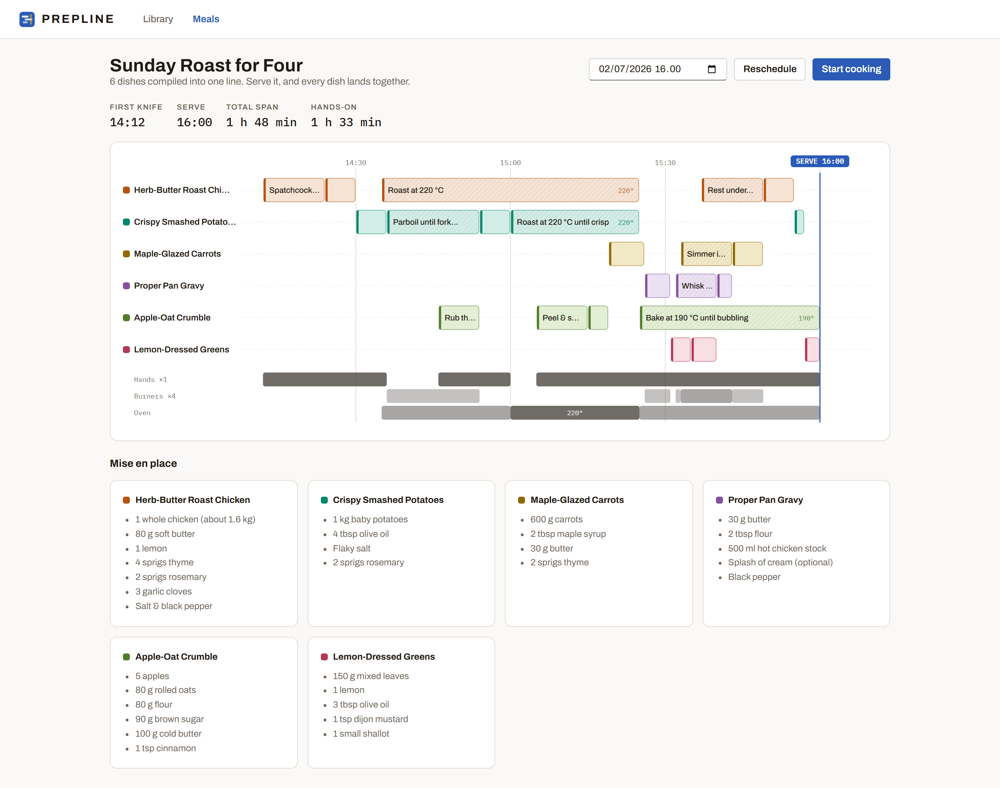
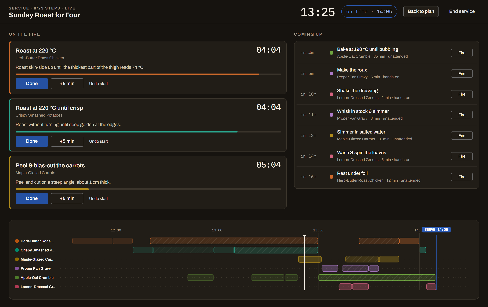
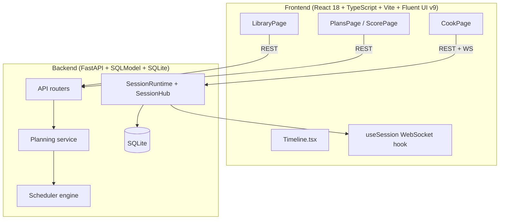

# Prepline

**The expediter for your home kitchen.**

Recipe apps store recipes in isolation. Real cooking is a scheduling problem: when you make a full meal (3–6 dishes, one pair of hands, N burners, one oven, and every dish has a "safe hold window"), getting everything ready at the same time is hard. Prepline compiles multiple recipes into one resource-aware, live-replanning timeline — a cooking score — and then conducts you through the meal in real time.



## Why Prepline is different

1. **Compile** — drop recipes into a meal plan. The scheduler builds a multi-track timeline constrained by your actual kitchen: hands, burners, oven temperature, and per-dish hold windows.
2. **Perform** — Cook Mode is a live conductor. It shows what's on the fire now, what's coming up, and exactly when to fire the next step.
3. **Reflow** — potatoes need 10 more minutes? One tap replans the rest of the evening. Every connected device sees the new ETA over WebSocket.

Kitchen vocabulary is deliberate: *fire* a step, *service* for cook mode, *the pass* for the serve flag, *mise en place* for the combined prep panel.



## Features

- **Resource-constrained scheduler** — one pair of hands, configurable burners, single oven at one temperature, and hold windows per dish.
- **Live replanning** — `delay`, `done`, `undo`, and `fire` events update a running session; the engine reschedules everything remaining from "now".
- **Multi-device sync** — open the same cook session on a laptop and phone; WebSocket broadcasts keep them in lockstep.
- **Timeline score** — custom SVG timeline shows every dish lane, hands/burner/oven usage, serve flag, and a dashed late-ETA flag when the plan slips.
- **Per-recipe serving overrides** — scale a dish up or down inside a plan; step durations and shopping-list quantities follow.
- **Demo content included** — `Sunday Roast for Four` with 6 recipes and 23+ scheduled steps out of the box.
- **Single-origin deploy** — build the frontend, then run the FastAPI backend; it serves `dist/` as an SPA with API fallback.

## Quickstart

### Backend

```bash
cd backend
uv sync
uv run uvicorn app.main:app --reload --port 8000
```

The app auto-seeds an empty database with the demo meal plan on first startup.

### Frontend (dev mode)

In a second terminal:

```bash
cd frontend
npm install
npm run dev
```

Vite proxies `/api` and WebSocket traffic to `:8000`.

### Single-origin (production-style)

```bash
cd frontend && npm install && npm run build
cd ../backend && uv run uvicorn app.main:app --port 8000
```

Then open http://localhost:8000.

### Run tests

```bash
# Backend
cd backend
uv run pytest -q

# Frontend
cd frontend
npm run test
npm run build
```

### Demo screenshots

```bash
cd backend
uv run python -m app.seed --reset      # fresh plan for the score screenshot
uv run python -m app.demo               # mid-service session for cook-mode screenshot
```

## How the scheduler works

The core scheduler is pure Python (`backend/app/scheduler/`). It knows nothing about HTTP or databases, so it is exhaustively unit-testable.

- **Time model** — integer minutes relative to the target serve time (`0` = serve, negative = before).
- **DAG validation** — unique ids, known dependencies, no cycles, durations ≥ 1.
- **Latest-fit greedy placement** — steps are ordered successors-first by unconstrained latest finish; ties go to the least-holdable dish. The engine walks backward from serve and places each step as late as possible against a minute-resolution occupancy ledger.
- **Resources** — active steps claim a "hands" slot; equipment claims burner/oven capacity; the oven additionally rejects two temperatures at once.
- **Live replan** — `replan()` pins completed steps to their actual times, projects running steps to `now + remaining`, and re-schedules the rest from the current minute. If the target serve time becomes impossible, the serve ETA slips minute-by-minute until a feasible plan is found.
- **Warnings** — `long_hold` (a dish finishes too early beyond its hold window) and `serve_pushed` (the target serve time slipped).

## API sketch

All times are naive UTC serialized as ISO-8601 with `Z`.

| Endpoint | Description |
|----------|-------------|
| `GET /api/recipes` | List recipes |
| `POST /api/recipes` | Create a recipe |
| `GET /api/recipes/{id}` | Get a recipe with steps |
| `PUT /api/recipes/{id}` | Update a recipe |
| `GET /api/plans` | List meal plans |
| `POST /api/plans` | Create a meal plan from recipes (optional `recipe_servings` map) |
| `POST /api/plans/{id}/schedule` | Generate/refresh the schedule |
| `POST /api/sessions` | Start a cook session from a plan |
| `GET /api/sessions/{id}` | Session snapshot |
| `POST /api/sessions/{id}/events` | Send `start_step`, `complete_step`, `delay_step`, `reset_step`, or `finish` |
| `WS /api/sessions/{id}/ws` | Live session sync |

Event payloads are JSON: `{ "type": "delay_step", "step_id": "...", "minutes": 5 }`.

## Architecture



## Design notes

- **Aesthetic:** the expo pass, not a lifestyle blog. Porcelain `#FAF9F7`, warm ink `#201B14`, tape blue `#2B5BB7` as the single interactive accent.
- **Type:** Archivo Variable for headings, IBM Plex Mono for every time/duration/countdown.
- **Cook Mode theme:** flips to a dark "service" theme (`#16130F`) — planning is daylight, service is heat.
- **Dish colors:** fixed per plan order (ember, teal, gold, plum, herb, rose) and validated for accessibility/CVD separation.

## Roadmap

- Recipe import/parsing (URL scrape, Markdown, Paprika export)
- Shopping list generation with unit consolidation
- Multi-cook assignment view (who owns which step)
- Oven preheat modeling (preheat as a schedulable step)
- PWA / mobile install with offline cook mode

## License

Prepline is licensed under the [GNU Affero General Public License v3.0 only](LICENSE) (AGPL-3.0-only).

## Contributing

```bash
# Backend formatting & lint
cd backend
uv run ruff check app tests
uv run black app tests
uv run isort app tests

# Frontend formatting
cd frontend
npm run format
```

Run the test suites before committing:

```bash
cd backend && uv run pytest -q
cd frontend && npm run test && npm run build
```

---

Built by [Ravi Purushottam](https://github.com/ravipurohit1991).
